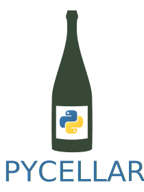

PYCELLAR
=======================

PYCELLAR is a package for wine cellar management, dashboard hosting, smart wine cellar control via cellartracker. 

Installation and usage
-----------------------

Either download the repository to your computer and install, e.g. by **pip**

.. code-block::

   pip install .

or install directly from Github.

.. code-block::

   pip install git+https://www.github.com/knutankv/koma.git@master

Thereafter, import the package modules, exemplified for the `winelib´ module, as follows:
    
.. code-block:: python

    import pycellar.winelib